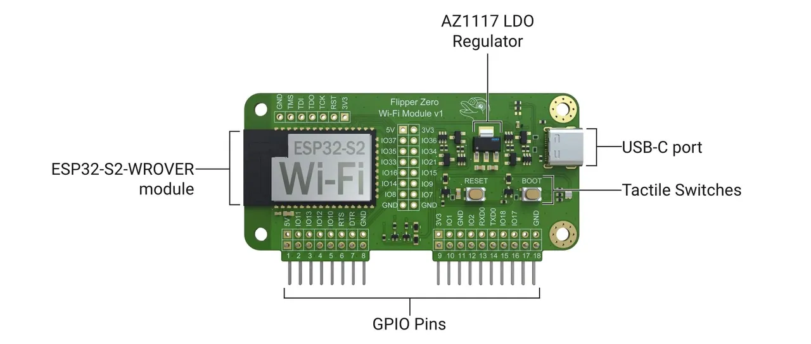

# Flipper Postman Board Software for ESP32S2 (Flipper Dev Board)

## Project Information

Custom flash software for Flipper Dev Board exposing the WIFI and HTTP methods via serial (UART) that can be picked up by the flipper zero device for building web enabled applications.


\*image taken from https://docs.flipper.net/development/hardware/wifi-developer-board/schematics

## Features

- Connect / Disonnect to WiFi networks
- List available WiFi networks
- Make HTTP GET, POST, PATCH and STREAM requests
- Custom HTTP request builder with all the methods GET, POST, HEAD, DELETE, PATCH, PUT, attach custom headers (Authorization), show and hide response headers
- Stream serial responses for large payloads.
- UDP communication, send commands and messages over the network via UDP packets
- LED indicators for different states

## Serial Monitor

<video src="https://flipper.spaceout.pl/demo.mp4">
  Your browser does not support the video tag.
</video>
*Arduino IDE Serial monitor communication

## UDP / Network communication

After you establish wifi the board listens to UDP packets you can use mobile apps (with TCP/UDP) or use cmd line tools like `echo -n "GET https://api.spacexdata.com/v3/rockets" | nc -u 192.168.0.115 1234`.

The board will transmit the local port and into the serial

You can also send custom messages to the flipper, type MESSAGE: <your text> for transmitting whatever you want to your flipper device.

## Flipper Zero Uart Terminal

<video src="https://flipper.spaceout.pl/demo-board-flipper.mp4">
  Your browser does not support the video tag.
</video>

## Installation (Build from source)

0. Git clone the project
1. Install Arduino IDE
2. Arduino IDE -> Settings (Preferences)

Copy and paste the `https://raw.githubusercontent.com/espressif/arduino-esp32/gh-pages/package_esp32_index.json`

3. Wait for installation
4. Arduino IDE -> Tools -> Manage Libraries -> find and install ArduinoJson
5. Arduino IDE -> Tools -> Boards -> Board manager -> find and install esp32 by expersif systems
6. Arduino IDE -> Select other board and port -> find and select ESP32S2 Dev Module
7. Arduino IDE -> Verify build
8. Connect board to usb
9. Boot board into bootloader mode (hold boot, and while holding the boot press the reset and release, then release boot button)
10. Arduino IDE -> Tools -> port -> select the port from your card (it should say esp32s2)
11. Arduino Ide --> Upload

After flashing the firmware reset the board, remove the usb cable and inject board into flipper.
You can switch on flipper GPIO -> UART Bridge (pins 13,14) --> plug into your usb cable, the port should now be open to to the board you can use minicom or arduino Serial Monitor to execute commands

## Installation via [esp flasher](https://github.com/0xchocolate/flipperzero-esp-flasher);

1. Download the files from the [release page](https://github.com/MassivDash/flipper-postman-esp32s2/releases)
2. Unplug your WiFi Dev Board and connect your Flipper Zero to your computer.
3. Copy the files into `sd_card/apps_data/esp_flasher/`
4. Open the ESP Flasher app on your Flipper. It should be located under `Apps -> GPIO` from the main menu. If not, download it from the Flipper App Store.
5. In the ESP Flasher app, select the following options:
   - "Reset Board": wait a few seconds, then go back.
   - "Enter Bootloader": wait until the 'waiting for download' message appears, then go back.
6. Click on Manual Flash.
7. Click on Bootloader and select the `flipper-postman-esp32s2.ino.bootloader.bin`.
8. Click on Part Table and select the `flipper-postman-esp32s2.ino.partitions.bin`.
9. Click on FirmwareA and select the `flipper-postman-esp32s2.ino.bin`.
10. Click on FLASH - slow. Wait for the green blinks
11. On the Dev Board, press the RESET button once.

## General Usage

The calls can be made directly via [UART Terminal Application](https://github.com/cool4uma/UART_Terminal). You can also connect flipper to your computer via usb cable then enter GPIO and enable the UART-USB Bridge to communicate directly to board via Arduino IDE Serial Monitor or [minicom](https://wiki.emacinc.com/wiki/Getting_Started_With_Minicom) cmd line program

1. Set the SSID and password for the WiFi connection using the `SET_SSID` and `SET_PASSWORD` commands.
2. Activate the WiFi connection using the `ACTIVATE_WIFI` command.
3. Use the `GET`, `POST`, or `GET_STREAM` commands to make HTTP requests.
4. Build custom HTTP requests using the `BUILD_HTTP_*` commands.
5. Execute custom HTTP requests using the `EXECUTE_HTTP_CALL` command.
6. Use the `?` or `HELP` commands to print help information.

## Example

```plaintext
SET_SSID MyWiFiNetwork
SET_PASSWORD MyWiFiPassword
ACTIVATE_WIFI
GET https://api.example.com/data
```

## SERIAL API Documentation

This section provides detailed information about the available commands, their descriptions, arguments, responses, and response types. It also includes the possible serial responses that the receiver can expect.

### Commands

| Command                                         | Description                                       | Arguments              | Response Type | Response Description                                                                                    |
| ----------------------------------------------- | ------------------------------------------------- | ---------------------- | ------------- | ------------------------------------------------------------------------------------------------------- |
| `SET_SSID <ssid>`                               | Set the SSID for the WiFi connection              | `<ssid>`               | Text          | `WIFI_SSID: <ssid>`                                                                                     |
| `SET_PASSWORD <password>`                       | Set the password for the WiFi connection          | `<password>`           | Text          | `WIFI_PASSWORD: <password>`                                                                             |
| `ACTIVATE_WIFI`                                 | Activate the WiFi connection                      | None                   | Text          | `WIFI_CONNECT: Connecting to WiFi...`                                                                   |
| `DISCONNECT_WIFI`                               | Disconnect from the WiFi network                  | None                   | Text          | `WIFI_DISCONNECT: Wifi disconnected`                                                                    |
| `LIST_WIFI`                                     | List available WiFi networks                      | None                   | Text          | `WIFI_LIST: <list>`                                                                                     |
| `GET <url>`                                     | Make an HTTP GET request to the specified URL     | `<url>`                | Text          | `GET: <url><br>STATUS: <number><br>RESPONSE:<br><response><br><RESPONSE_END>`                           |
| `GET_STREAM <url>`                              | Make an HTTP GET request and stream the response  | `<url>`                | Stream        | `GET_STREAM: <url><br>STATUS: <number><br>STREAM: <br><streamed data><br>STREAM_END`                    |
| `POST <url> <json_payload>`                     | Make an HTTP POST request with a JSON payload     | `<url> <json_payload>` | Text          | `POST: <url><br>Payload: <json_payload><br>STATUS: <number><br>RESPONSE:<br><response><br>RESPONSE_END` |
| `BUILD_HTTP_METHOD <method>`                    | Set the HTTP method for the custom request        | `<method>`             | Text          | `HTTP_SET_METHOD: <method>`                                                                             |
| `BUILD_HTTP_URL <url>`                          | Set the URL for the custom HTTP request           | `<url>`                | Text          | `HTTP_URL: <url>`                                                                                       |
| `BUILD_HTTP_HEADER <header>`                    | Add a header to the custom HTTP request           | `<header>`             | Text          | `HTTP_ADD_HEADER: <header>`                                                                             |
| `BUILD_HTTP_PAYLOAD <payload>`                  | Set the payload for the custom HTTP request       | `<payload>`            | Text          | `HTTP_SET_PAYLOAD: <payload>`                                                                           |
| `REMOVE_HTTP_HEADER <header>`                   | Remove a header from the custom HTTP request      | `<header>`             | Text          | `HTTP_REMOVE_HEADER: <header>`                                                                          |
| `RESET_HTTP_CONFIG`                             | Reset the custom HTTP request configuration       | None                   | Text          | `HTTP_CONFIG_REST: All configurations reset`                                                            |
| `BUILD_HTTP_SHOW_RESPONSE_HEADERS <true/false>` | Show or hide HTTP response headers                | `<true/false>`         | Text          | `HTTP_BUILDER_SHOW_RESPONSE_HEADERS: <true/false>`                                                      |
| `BUILD_HTTP_IMPLEMENTATION <STREAM/CALL>`       | Set the HTTP implementation type (STREAM or CALL) | `<STREAM/CALL>`        | Text          | `HTTP_SET_IMPLEMENTATION: <STREAM/CALL>`                                                                |
| `EXECUTE_HTTP_CALL`                             | Execute the custom HTTP request                   | None                   | Text/Stream   | Depends on the implementation type (STREAM or CALL)                                                     |
| `CONNECT <SSID> <password>`                     | Connect to a WiFi network with SSID and password  | `<SSID> <password>`    | Text          | `WIFI_SSID: <SSID><br>WIFI_PASSWORD: <password><br>WIFI_CONNECT: Connecting to WiFi...`                 |
| `?`                                             | Print help information                            | None                   | Text          | `Available Commands: <list of commands>`                                                                |
| `HELP`                                          | Print help information                            | None                   | Text          | `Available Commands: <list of commands>`                                                                |

#### Sending Commands

To set the SSID for the WiFi connection:

```plaintext
SET_SSID MyWiFiNetwork
```

To make an HTTP GET request:

```plaintext
GET https://api.example.com/data
```

To make an HTTP GET request and stream the response:

```plaintext
GET_STREAM https://api.example.com/data
```

To make an HTTP POST request with a JSON payload:

```plaintext
POST https://api.example.com/data {"key":"value"}
```

#### Receiving Responses

When you send a `GET_STREAM` command, you will receive the following responses:

```plaintext
GET_STREAM request to: https://api.example.com/data
STREAM:
<streamed data>
STREAM_END
```

When you list available WiFi networks:

```plaintext
WIFI_LIST: Available WiFi networks: <list>
```

## Notes

- The firmware currently does not follow redirects,
- Website crawls will print html only on smaller websites.
- You should be able to stream files and images to flipper via stream (untested)
- Simple get call will make a head call first and determine the possible size of the content, that will not always be possible, if the content length is unknown, firmware will choose safer stream method
